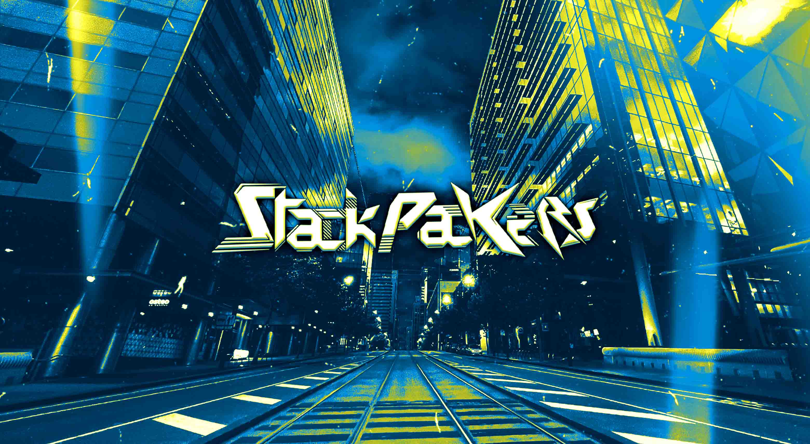

# ⚡ Stackpackers – Drum & Bass Duo Website



**A storm in full force, shaking the scene with explosive sets and powerful soundscapes.**  
Built with 💚 Next.js, Tailwind CSS.

---

## 🔥 Live Site

👉 [stackpackers.com](https://stackpackers.com)

---

## 🚀 Tech Stack

- **Framework**: [Next.js](https://nextjs.org)
- **Styling**: [Tailwind CSS](https://tailwindcss.com)
- **SEO / Metadata**: Open Graph, JSON-LD, Meta + TikTok/Facebook Pixels
- **Custom Components**:
  - `ParticleOverlay` – floating visuals behind content
  - `LightningOverlay` – electric ⚡
  - `HeroSection`, `Info`, `Music`, `Shows`, `Links`, `Contact`, `Footer`

---

## 🎯 Key Features

- 🎨 Animated gradient background
- 💡 Dynamic visual overlays (particles + lightning)
- 🧠 SEO-optimized with meta, Open Graph, and structured data
- 🔗 Embedded social and music platforms (SoundCloud, Spotify, etc.)
- 📅 Live shows section
- 📞 Contact form
- 🧭 Smooth scroll & interactive navigation

---

## 🛠️ Setup Instructions

```bash
# 1. Clone this repo
git clone https://github.com/saradomincroft/stackpackers-website.git

# 2. Navigate into the project
cd stackpackers-website

# 3. Install dependencies
npm install

# 4. Run the dev server
npm run dev

## 💻 Project Structure
.
├── app/                         
│   ├── page.tsx                 # Main homepage
│   ├── layout.tsx               # Main app layout component
│   └── global.css               # Global styles (custom CSS)
├── components/                  
│   ├── Contact.tsx              # Contact component
│   ├── Footer.tsx               # Footer component
│   ├── HeroSection.tsx          # Hero section component
│   ├── Info.tsx                 # Info section component
│   ├── LightningOverlay.tsx     # Lightning overlay component
│   ├── Links.tsx                # Links section component
│   ├── Music.tsx                # Music section component
│   ├── Navbar.tsx               # Navbar component
│   ├── ParticleOverlay.tsx      # Particle overlay component
│   ├── Shows.tsx                # Shows section component
│   ├── Video.tsx                # Video component (not included in the final structure)
│   └── Gallery.tsx              # Gallery component (not included in the final structure)
├── styles/                      
│   ├── HeroSection.module.css   # Styles for the HeroSection component
│   └── Links.module.css         # Styles for the LinksSection component
     
